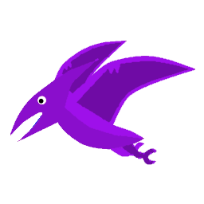

<h1 align="left" id="kodirati-title">hi there, i'm kodirati.</h1>
<h3 align="left">i take projects to a level <bold>above</bold> next.</h3>

 

<h2 align="left" id="kodirati">my knowledge</h2>

> what i use day by day, my tools.

<table>
  <tr>
    <td align="center" width="96">
      
       java development
    </td>
    <td align="center" width="96">
      
       mongodb development & management
    </td>
    <td align="center" width="96">
      
       pterodactyl setups & management
    </td>
    <td align="center" width="96">
      
       minecraft setups, management & development (5+ yrs)
    </td>
    <td align="center" width="96">
      
       discord setups, management & development (5+ yrs)
    </td>
  </tr>
</table>

 

<h2 align="left" id="kodirati">my statistics</h2>

> some brief statistics on my publicized code.

